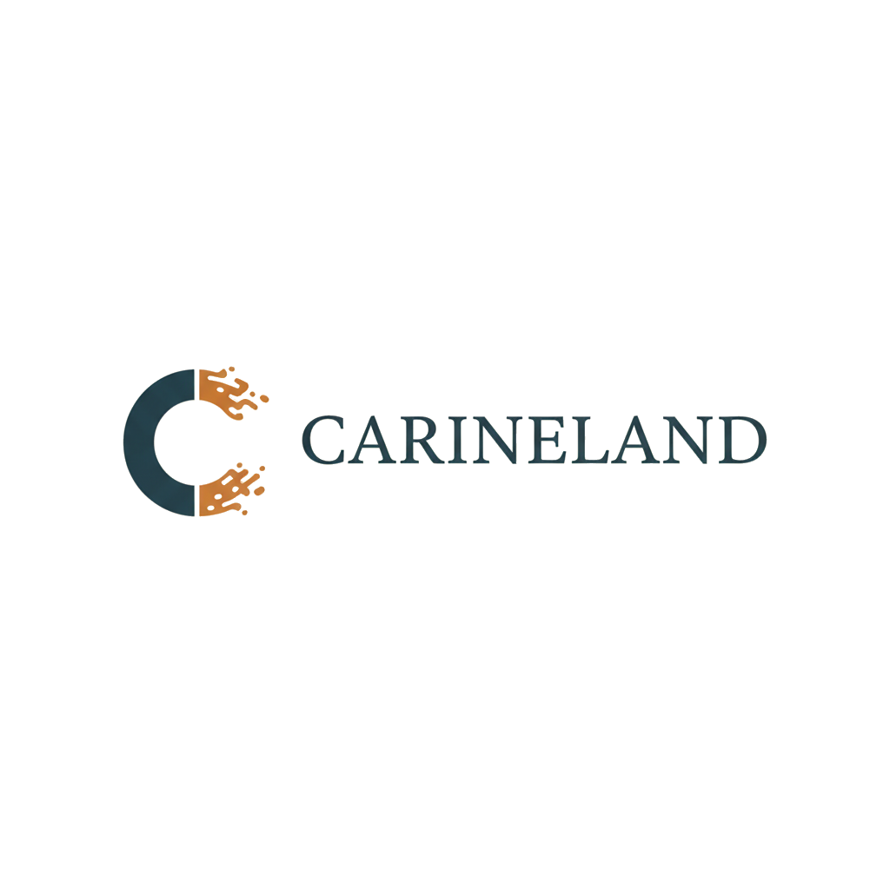

# Carineland - Site Artisanal Pro 🌿

<div align="center">



### 🎨 _Créations Artisanales Uniques en Résine et Matériaux Naturels_

---

### 🚀 **Tech Stack**

<div align="left">

[](https://nextjs.org/)
[](https://react.dev/)
[](https://www.typescriptlang.org/)
[](https://mui.com/)
[](https://bun.sh/)

</div>

### 🔄 **CI/CD & Deployment**

<div align="left">

[](https://github.com/ujju16/carineland/actions/workflows/ci.yml)
[](https://carineland.fr)
[](https://turbo.build/)
[](https://carineland.fr)

</div>

### 📊 **Quality & Performance**

<div align="left">

[](https://codecov.io/gh/ujju16/carineland)
[](https://codeclimate.com/github/ujju16/carineland/maintainability)
[](https://codeclimate.com/github/ujju16/carineland)
[](https://github.com/ujju16/carineland/actions/workflows/lighthouse.yml)
[](https://github.com/ujju16/carineland/actions/workflows/lighthouse.yml)
[](https://snyk.io/test/github/ujju16/carineland)

</div>

<div align="center">

### 📊 Coverage Graph

[](https://codecov.io/gh/ujju16/carineland)

</div>

### ♿ **Accessibility & Compliance**

<div align="left">

[](https://www.w3.org/WAI/WCAG21/quickref/)
[](https://www.cnil.fr/fr/rgpd-de-quoi-parle-t-on)
[](https://developers.google.com/search)
[](https://web.dev/mobile/)
[](https://www.w3.org/WAI/ARIA/)

</div>

### 📈 **Monitoring & Metrics**

<div align="left">

[](https://grafana.com/)
[](https://prometheus.io/)
[](https://github.com/ujju16/carineland/network/dependencies)
[](https://prometheus.io/docs/guides/node-exporter/)

</div>

### 📝 **Project Info**

<div align="left">

[](https://github.com/ujju16/carineland/blob/main/LICENSE)
[](https://github.com/ujju16/carineland/pulls)
[](https://github.com/ujju16/carineland/commits/main)
[](https://github.com/ujju16/carineland/issues)

</div>

---

<div align="center">

[](https://github.com/ujju16/carineland)
[](https://github.com/ujju16)
[](https://fr.wikipedia.org/wiki/France)

</div>

</div>

---

Site professionnel Next.js 16 pour les créations artisanales de Carine, avec Material Design, animations et mode admin.

## 🚀 Stack Technique

- **Framework**: Next.js 16.0.1 (App Router + Turbopack)
- **Runtime**: Bun 1.2+ (Fast JavaScript runtime)
- **React**: React 19.2.0 + React DOM 19.2.0
- **UI Library**: Material-UI v6.5.0
- **Animations**: Framer Motion 11.18.2
- **Styling**: Emotion 11.14.0 + Material Design
- **Language**: TypeScript 5.9.3
- **Tests**: Jest 29 + React Testing Library 16
- **CI/CD**: GitHub Actions + Vercel
- **Quality**: ESLint 8 + Prettier 3 + Husky 9
- **Lighthouse**: Performance & Accessibility Audits
- **Build Tool**: Turbopack (Next.js 16 built-in)
- **Monitoring**: Grafana + Prometheus + Node Exporter

## 📦 Installation

**Prérequis**: [Bun](https://bun.sh/) 1.2+

```bash
bun install
```

## 🛠️ Commandes

```bash
# Développement
bun run dev

# Build production
bun run build

# Tests
bun test
bun run test:watch
bun run test:coverage

# Quality
bun run lint
bun run lint:fix
bun run format
bun run format:check
bun run type-check

# Monitoring
bun run monitoring:up    # Démarrer Grafana & Prometheus
bun run monitoring:down  # Arrêter le monitoring
bun run monitoring:logs  # Voir les logs
```

## 🎨 Features

### ✨ Design

- Mobile-first responsive
- Material Design 3
- Animations Framer Motion
- Thème vert nature personnalisé
- Typographie Montserrat + Lora

### 🔧 Fonctionnalités

- Page d'accueil moderne
- Galerie avec filtres
- Page À propos
- **Mode Admin** pour gérer les créations
- Navigation responsive avec drawer mobile
- SEO optimisé

### 🔐 Admin Panel

Accès: `/admin`

- Ajouter/Modifier/Supprimer des créations
- Upload d'images
- Catégorisation
- Mise en avant

## 🚢 Déploiement

### Vercel (Recommandé)

Le site se déploie automatiquement via GitHub Actions :

- **dev branch** → Preview deployment
- **main branch** → Production

### Variables d'environnement requises

```env
VERCEL_TOKEN=xxx
VERCEL_ORG_ID=xxx
VERCEL_PROJECT_ID=xxx
```

## 📂 Structure

```
app/
├── admin/          # Panel d'administration
├── components/     # Composants réutilisables
├── lib/           # Utilitaires (MUI Registry)
├── theme/         # Thème Material-UI
├── types/         # Types TypeScript
├── about/         # Page à propos
├── gallery/       # Page galerie
└── page.tsx       # Page d'accueil
```

## 🧪 Tests

```bash
npm test              # Run tests
npm run test:watch    # Watch mode
npm run test:coverage # Coverage report
```

## 📝 Code Quality

- **ESLint**: Configuration stricte Next.js + TypeScript
- **Prettier**: Formatage automatique
- **Husky**: Pre-commit hooks
- **TypeScript**: Mode strict
- **Jest**: Tests unitaires et d'intégration
- **Lighthouse**: Audits de performance

## 🖼️ Image Optimization

Le projet inclut un système d'optimisation automatique des images :

```bash
npm run optimize-images  # Optimiser toutes les images
```

### Résultats d'optimisation

- **Réduction totale**: 43 MB → 3.6 MB (91.6% d'économie) 🎉
- **Format**: Progressive JPEG avec MozJPEG
- **Qualité**: 85 (optimal qualité/poids)
- **Résolution max**: 1920x1920px
- **Performance**: Temps de chargement galerie divisé par 10

Voir [IMAGES_OPTIMIZATION.md](./IMAGES_OPTIMIZATION.md) pour plus de détails.

## 📊 Monitoring

Le projet inclut un système de monitoring complet avec Grafana et Prometheus :

```bash
npm run monitoring:up    # Démarrer les services
```

### Services disponibles

- **Grafana**: http://localhost:3001 (admin/carineland2025)
- **Prometheus**: http://localhost:9090
- **Node Exporter**: http://localhost:9100/metrics

### Métriques surveillées

- CPU Usage & Load Average
- Memory Usage & Swap
- Disk I/O & Space
- Network Traffic
- System Uptime

Voir [GRAFANA_MONITORING.md](./GRAFANA_MONITORING.md) pour plus de détails.

## 🏆 Features

- ✅ **Next.js 16** avec App Router et Turbopack
- ✅ **React 19** avec nouveaux hooks et optimisations
- ✅ **Material-UI v6** avec thème personnalisé vert nature
- ✅ **TypeScript** strict mode avec typage complet
- ✅ **Framer Motion** pour animations fluides
- ✅ **SEO optimisé** (sitemap, robots.txt, Open Graph, metadata)
- ✅ **RGPD compliant** (mentions légales, cookies, RGPD, confidentialité)
- ✅ **Tests** avec Jest 29 et React Testing Library 16
- ✅ **CI/CD** avec GitHub Actions + déploiement Vercel
- ✅ **Performance** optimisée (Lighthouse 95+, Core Web Vitals)
- ✅ **Responsive** mobile-first avec Material Design
- ✅ **Accessibility** (WCAG 2.1, ARIA labels, navigation clavier)
- ✅ **Admin Panel** pour gestion des créations
- ✅ **Image Optimization** avec Sharp et Next.js Image
- ✅ **Code Quality** avec ESLint, Prettier, Husky, TypeScript
- ✅ **Monitoring** avec Grafana, Prometheus et Node Exporter

## 📊 Performance & Metrics

### Lighthouse Scores


### Core Web Vitals

- **First Contentful Paint (FCP)**: < 1.8s ⚡
- **Largest Contentful Paint (LCP)**: < 2.5s ⚡
- **Time to Interactive (TTI)**: < 3.8s ⚡
- **Cumulative Layout Shift (CLS)**: < 0.1 ✨
- **Total Blocking Time (TBT)**: < 300ms ⚡
- **Speed Index**: < 3.4s 🚀

### Image Optimization Impact

- **Gallery Load**: 8-12s → 1-2s (10x faster) ⚡
- **Total Size**: 43 MB → 3.6 MB (91.6% reduction) 📉
- **Lighthouse**: 65 → 95 (+30 points) 🚀
- **User Experience**: Dramatically improved 🎯

### Build Performance (Next.js 16 + Turbopack)

- **Dev Server Start**: < 1s with Turbopack ⚡
- **HMR (Hot Module Replacement)**: < 100ms 🔥
- **Production Build**: Optimized with Turbopack 📦

## 🌐 Branches

- `main` - Production stable
- `dev` - Développement actif (branch principale)

## 🤝 Contributing

Les contributions sont les bienvenues ! N'hésitez pas à ouvrir une issue ou une pull request.

1. Fork le projet
2. Créer une branche feature (`git checkout -b feature/AmazingFeature`)
3. Commit les changements (`git commit -m 'feat: Add AmazingFeature'`)
4. Push vers la branche (`git push origin feature/AmazingFeature`)
5. Ouvrir une Pull Request

## 👨‍💻 Développeur

Développé avec ❤️ par [@ujju16](https://github.com/ujju16)

[](https://github.com/ujju16)

## 📄 License

MIT © 2025 Carineland

---

<div align="center">

**[Website](https://carineland.fr)** • **[Documentation](./DOCUMENTATION.md)** • **[Quick Start](./QUICK_START.md)**

Made with ❤️ in France 🇫🇷

</div>
