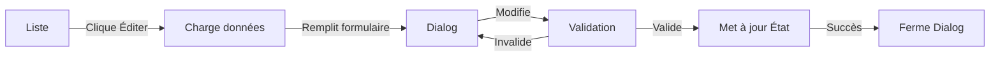

# Schéma de Données - Administration Carineland

## 📊 Vue d'ensemble

Ce document détaille le schéma de données complet pour la page d'administration de Carineland, incluant les types TypeScript, les structures de données, les relations et les validations.

## 🗂️ Table des matières

1. [Modèle de données principal](#modèle-de-données-principal)
2. [Types TypeScript](#types-typescript)
3. [Structure de la base de données](#structure-de-la-base-de-données)
4. [Relations](#relations)
5. [Validations](#validations)
6. [API Endpoints](#api-endpoints)
7. [États de l'application](#états-de-lapplication)
8. [Exemples de données](#exemples-de-données)

---

## 🎨 Modèle de données principal

### Creation (Création artistique)

```typescript
interface Creation {
  // Identifiants
  id: string                    // UUID ou timestamp unique
  slug: string                  // URL-friendly version du titre
  
  // Informations de base
  title: string                 // Titre de la création (requis)
  description: string           // Description détaillée (requis)
  
  // Média
  imageUrl: string              // URL de l'image principale
  imageAlt: string              // Texte alternatif pour l'image (accessibilité)
  
  // Classification
  category: CreationCategory    // Catégorie de la création
  tags: string[]                // Tags pour recherche et filtrage
  
  // Détails techniques
  year: number                  // Année de création
  materials: string[]           // Matériaux utilisés
  dimensions: string            // Dimensions (texte libre)
  
  // Commercialisation
  price?: number                // Prix optionnel (en euros)
  available: boolean            // Disponibilité à la vente
  featured: boolean             // Mise en avant sur la page d'accueil
  
  // Métadonnées
  createdAt: string             // Date de création (ISO 8601)
  updatedAt: string             // Date de dernière modification (ISO 8601)
}
```

### CreationCategory (Énumération)

```typescript
type CreationCategory = 
  | 'couronne'      // Couronnes décoratives
  | 'composition'   // Compositions florales
  | 'decoration'    // Décorations diverses
  | 'sculpture'     // Sculptures en bois flotté
  | 'autre'         // Autres créations
```

---

## 📝 Types TypeScript

### Fichier: `app/types/index.ts`

```typescript
// Type principal pour les créations
export interface Creation {
  id: string
  title: string
  slug: string
  description: string
  imageUrl: string
  imageAlt: string
  category: string
  year: number
  materials: string[]
  dimensions: string
  price?: number
  available: boolean
  featured: boolean
  tags: string[]
  createdAt: string
  updatedAt: string
}

// Type pour les utilisateurs admin
export interface AdminUser {
  id: string
  email: string
  role: 'admin' | 'editor'
}

// Type pour les filtres de galerie
export interface GalleryFilter {
  category?: string
  featured?: boolean
  searchTerm?: string
}

// Type pour l'authentification NextAuth
export interface AuthSession {
  user: {
    id: string
    name: string
    email: string
  }
  expires: string
}

// Type pour le formulaire de création
export interface CreationFormData {
  title: string
  description: string
  imageUrl: string
  category: string
  featured: boolean
}
```

---

## 🗄️ Structure de la base de données

### Format actuel: JSON local

**Fichier:** `app/data/creations.json`

```json
[
  {
    "id": "creation-1",
    "title": "Table/tabouret en bois flotté/racines",
    "slug": "tabletabouret-en-bois-flotteracines",
    "description": "Table/tabouret en bois flotté/racines",
    "category": "sculpture",
    "imageUrl": "/creations/20231024_211212.jpg",
    "imageAlt": "Table/tabouret en bois flotté/racines",
    "year": 2023,
    "materials": ["bois flotté", "racines"],
    "dimensions": "Grande pièce (> 50cm)",
    "available": true,
    "featured": true,
    "tags": ["bois", "racines", "mobilier", "fonctionnel", "artisanat", "fait main", "unique"],
    "createdAt": "2025-11-02T02:49:26.062Z",
    "updatedAt": "2025-11-02T02:49:26.062Z"
  }
]
```

### Migration vers Strapi (prévu)

#### Collection Type: `creation`

| Champ | Type | Options | Description |
|-------|------|---------|-------------|
| title | Text | Required, Unique | Titre de la création |
| slug | UID | Required, Target: title | URL slug |
| description | Rich Text | Required | Description longue |
| image | Media | Single, Images only | Image principale |
| category | Enumeration | couronne, composition, decoration, sculpture, autre | Catégorie |
| year | Number | Integer, Min: 2000 | Année de création |
| materials | JSON | Array of strings | Liste des matériaux |
| dimensions | Text | - | Dimensions en texte libre |
| price | Decimal | Optional, Min: 0 | Prix en euros |
| available | Boolean | Default: true | Disponibilité |
| featured | Boolean | Default: false | Mise en avant |
| tags | JSON | Array of strings | Tags de recherche |

---

## 🔗 Relations

### Relations actuelles (état local)

- **Aucune relation** : Les créations sont actuellement indépendantes
- Gestion en mémoire via React State

### Relations prévues avec Strapi

```
┌─────────────┐
│  Creation   │
├─────────────┤
│ id          │
│ title       │
│ category    │◄───┐
│ materials   │    │
│ tags        │    │
└─────────────┘    │
                   │
      ┌────────────┴────────────┐
      │                         │
┌─────▼──────┐          ┌──────▼─────┐
│  Category  │          │    Tag     │
├────────────┤          ├────────────┤
│ id         │          │ id         │
│ name       │          │ name       │
│ slug       │          │ slug       │
└────────────┘          └────────────┘
```

### Relations avec authentification

```
┌──────────────┐       ┌──────────────┐
│  AdminUser   │──────►│  Creation    │
├──────────────┤       ├──────────────┤
│ id           │       │ id           │
│ email        │       │ authorId     │
│ role         │       │ title        │
└──────────────┘       └──────────────┘
   (1)                      (n)
```

---

## ✅ Validations

### Validation côté client (React)

```typescript
// Validation du formulaire
const validateCreationForm = (data: CreationFormData): ValidationErrors => {
  const errors: ValidationErrors = {}
  
  // Titre requis (3-100 caractères)
  if (!data.title || data.title.trim().length < 3) {
    errors.title = 'Le titre doit contenir au moins 3 caractères'
  }
  if (data.title && data.title.length > 100) {
    errors.title = 'Le titre ne peut pas dépasser 100 caractères'
  }
  
  // Description requise (10-1000 caractères)
  if (!data.description || data.description.trim().length < 10) {
    errors.description = 'La description doit contenir au moins 10 caractères'
  }
  if (data.description && data.description.length > 1000) {
    errors.description = 'La description ne peut pas dépasser 1000 caractères'
  }
  
  // Image URL valide
  if (data.imageUrl && !isValidUrl(data.imageUrl)) {
    errors.imageUrl = 'L\'URL de l\'image n\'est pas valide'
  }
  
  // Catégorie valide
  const validCategories = ['couronne', 'composition', 'decoration', 'sculpture', 'autre']
  if (!validCategories.includes(data.category)) {
    errors.category = 'Catégorie invalide'
  }
  
  return errors
}
```

### Règles de validation

| Champ | Règles | Message d'erreur |
|-------|--------|------------------|
| title | Requis, 3-100 caractères | "Le titre est requis" |
| description | Requis, 10-1000 caractères | "La description est requise" |
| imageUrl | URL valide | "URL d'image invalide" |
| category | Enum valide | "Catégorie invalide" |
| year | 2000 ≤ year ≤ année actuelle | "Année invalide" |
| price | ≥ 0 | "Le prix doit être positif" |
| materials | Array, max 10 items | "Maximum 10 matériaux" |
| tags | Array, max 20 items | "Maximum 20 tags" |

---

## 🔌 API Endpoints

### Endpoints actuels (planifiés)

```typescript
// GET /api/creations - Liste toutes les créations
GET /api/creations
Response: {
  data: Creation[]
  total: number
  page: number
  pageSize: number
}

// GET /api/creations/:id - Détails d'une création
GET /api/creations/creation-1
Response: {
  data: Creation
}

// POST /api/creations - Créer une création
POST /api/creations
Body: {
  title: string
  description: string
  imageUrl: string
  category: string
  featured: boolean
}
Response: {
  data: Creation
  message: "Création créée avec succès"
}

// PUT /api/creations/:id - Modifier une création
PUT /api/creations/creation-1
Body: Partial<Creation>
Response: {
  data: Creation
  message: "Création mise à jour"
}

// DELETE /api/creations/:id - Supprimer une création
DELETE /api/creations/creation-1
Response: {
  message: "Création supprimée"
}
```

### Filtres et recherche

```typescript
// GET /api/creations?category=sculpture&featured=true
GET /api/creations
Query params:
  - category: string
  - featured: boolean
  - search: string
  - page: number
  - limit: number
  - sortBy: 'createdAt' | 'updatedAt' | 'title'
  - sortOrder: 'asc' | 'desc'
```

---

## 🎛️ États de l'application

### État global de l'admin

```typescript
interface AdminState {
  // Données
  creations: Creation[]
  loading: boolean
  error: string | null
  
  // UI State
  openDialog: boolean
  editingCreation: Creation | null
  selectedCreations: string[]
  
  // Filtres
  filters: {
    category: string | null
    search: string
    featured: boolean | null
  }
  
  // Pagination
  pagination: {
    page: number
    pageSize: number
    total: number
  }
}
```

### États du formulaire

```typescript
interface FormState {
  // Données du formulaire
  formData: Partial<Creation>
  
  // Validation
  errors: Record<string, string>
  touched: Record<string, boolean>
  isValid: boolean
  
  // Soumission
  isSubmitting: boolean
  submitError: string | null
}
```

---

## 📦 Exemples de données

### Création complète

```json
{
  "id": "creation-42",
  "title": "Couronne de Noël en bois flotté",
  "slug": "couronne-de-noel-en-bois-flotte",
  "description": "Magnifique couronne artisanale composée de bois flotté ramassé sur les plages de Normandie, ornée de pommes de pin naturelles et d'un ruban rouge élégant. Pièce unique faite main avec soin.",
  "imageUrl": "/creations/couronne-noel-2024.jpg",
  "imageAlt": "Couronne de Noël artisanale en bois flotté avec pommes de pin et ruban rouge",
  "category": "couronne",
  "year": 2024,
  "materials": [
    "bois flotté",
    "pommes de pin",
    "ruban satin",
    "fil de fer"
  ],
  "dimensions": "Diamètre 35cm, épaisseur 8cm",
  "price": 45.00,
  "available": true,
  "featured": true,
  "tags": [
    "noël",
    "hiver",
    "couronne",
    "bois flotté",
    "artisanat",
    "fait main",
    "normandie",
    "décoration murale"
  ],
  "createdAt": "2024-11-01T14:30:00.000Z",
  "updatedAt": "2024-11-05T09:15:00.000Z"
}
```

### Création minimale

```json
{
  "id": "creation-43",
  "title": "Composition florale",
  "slug": "composition-florale",
  "description": "Belle composition de fleurs séchées pour décoration d'intérieur.",
  "imageUrl": "/creations/composition-01.jpg",
  "imageAlt": "Composition florale artisanale",
  "category": "composition",
  "year": 2024,
  "materials": ["fleurs séchées"],
  "dimensions": "Variable",
  "available": true,
  "featured": false,
  "tags": ["fleurs", "décoration"],
  "createdAt": "2024-11-06T10:00:00.000Z",
  "updatedAt": "2024-11-06T10:00:00.000Z"
}
```

### Liste de créations (API response)

```json
{
  "data": [
    {
      "id": "creation-1",
      "title": "Couronne de Noël",
      "slug": "couronne-de-noel",
      "featured": true,
      "imageUrl": "/creations/photo1.jpg",
      "category": "couronne"
    },
    {
      "id": "creation-2",
      "title": "Composition zen",
      "slug": "composition-zen",
      "featured": false,
      "imageUrl": "/creations/photo2.jpg",
      "category": "composition"
    }
  ],
  "meta": {
    "total": 42,
    "page": 1,
    "pageSize": 20,
    "totalPages": 3
  }
}
```

---

## 🔄 Flux de données

### Création d'une nouvelle création

```mermaid
graph LR
    A[Utilisateur] -->|Clique "Nouvelle Création"| B[Dialog]
    B -->|Remplit formulaire| C[Validation]
    C -->|Valide| D[Sauvegarde État]
    C -->|Invalide| B
    D -->|Succès| E[Ferme Dialog]
    E -->|Rafraîchit| F[Liste créations]
```

### Modification d'une création



---

## 🚀 Migration vers Strapi

### Étapes de migration

1. **Installation Strapi**
   ```bash
   npx create-strapi-app@latest strapi-backend
   ```

2. **Création du Content Type "Creation"**
   - Via Strapi Admin UI
   - Configurer tous les champs selon le schéma

3. **Migration des données**
   ```typescript
   // scripts/migrate-to-strapi.ts
   import creations from '../app/data/creations.json'
   
   async function migrate() {
     for (const creation of creations) {
       await fetch(`${STRAPI_URL}/api/creations`, {
         method: 'POST',
         headers: {
           'Authorization': `Bearer ${STRAPI_TOKEN}`,
           'Content-Type': 'application/json'
         },
         body: JSON.stringify({ data: creation })
       })
     }
   }
   ```

4. **Update API Routes**
   - Remplacer l'état local par les appels Strapi API
   - Implémenter le cache avec Next.js

---

## 📊 Statistiques et métriques

### Métriques à tracker

```typescript
interface CreationMetrics {
  totalCreations: number
  featuredCreations: number
  availableCreations: number
  creationsByCategory: Record<string, number>
  creationsByYear: Record<number, number>
  averagePrice: number
  mostUsedMaterials: Array<{ material: string; count: number }>
  mostUsedTags: Array<{ tag: string; count: number }>
}
```

---

## 🔒 Sécurité

### Protection des données

- ✅ Authentification requise pour toutes les opérations CRUD
- ✅ Validation des données côté serveur
- ✅ Sanitization des inputs pour prévenir XSS
- ✅ Rate limiting sur les API endpoints
- ✅ CORS configuré pour domaines autorisés uniquement

### Exemple de middleware de protection

```typescript
// middleware/auth.ts
export async function requireAuth(req: NextRequest) {
  const session = await getServerSession(authOptions)
  
  if (!session || !session.user) {
    return new Response('Unauthorized', { status: 401 })
  }
  
  return null // Continue
}
```

---

## 📚 Références

- [TypeScript Documentation](https://www.typescriptlang.org/)
- [Next.js Data Fetching](https://nextjs.org/docs/app/building-your-application/data-fetching)
- [Strapi Documentation](https://docs.strapi.io/)
- [NextAuth.js](https://next-auth.js.org/)
- [JSON Schema](https://json-schema.org/)

---

## 👨‍💻 Développeur

**@ujju16** - Développeur Full Stack

---

**Version:** 1.0.0  
**Dernière mise à jour:** 6 novembre 2024  
**Statut:** En développement actif
